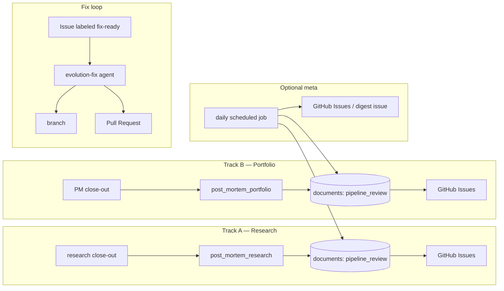

# Evolution backlog + GitHub issues — implementation plan

This document describes how to wire **post-mortem reviews** (after Track A research and after Track B portfolio) into **GitHub Issues**, enable **daily or per-run automation**, and support an **agent-driven fix loop** (branch → PR). It is a roadmap; implement in phases.

---

## 1. Goals

| Goal | Mechanism |
|------|-----------|
| Capture flaws and improvement ideas from each run | Structured review JSON in Supabase (`documents`) + optional GitHub Issues |
| Avoid duplicate noise | Deterministic dedupe keys + labels |
| Run at end of each track | Cowork task steps + optional CI |
| Human triage | GitHub Issues as backlog |
| Automated / agentic fixes | Dedicated agent + `gh` CLI or GitHub API; PR for human review |

**Principles:** validation stays **deterministic** (existing `validate_*.py`); **semantic** review (LLM) suggests only — it does not merge. Issue creation is **idempotent** per `(date, track, dedupe_key)`.

---

## 2. High-level architecture



---

## 3. GitHub repository setup (Phase 0)

**Labels** (create once in the repo):

| Label | Meaning |
|-------|---------|
| `evolution` | All items from this system |
| `track/research` | After Track A review |
| `track/portfolio` | After Track B review |
| `type/validation` | Schema / `validate_*` failures |
| `type/semantic` | Content quality / depth / consistency |
| `type/prompt-task` | Cowork task / skill / agent instruction change |
| `type/script` | Python/shell automation |
| `severity/blocking` | Run failed or publish blocked |
| `source/post-mortem` | Created by post-mortem step |

**Issue templates** (optional, `.github/ISSUE_TEMPLATE/`):

- `pipeline-improvement.md` — problem, proposed fix, links to `documents` date + `document_key`, dedupe id.

**Permissions:**

- **Local / Cursor agent:** `gh auth login` with scopes `repo`, `read:org` (and `workflow` if touching Actions).
- **CI (optional):** `GITHUB_TOKEN` default in Actions can open issues in **same** repo; for cross-repo or org-wide rules use a **fine-grained PAT** stored as `EVOLUTION_ISSUES_TOKEN` (secret).

---

## 4. Canonical data in Supabase (before GitHub)

Introduce a small, versioned JSON payload (new `doc_type` or reuse evolution family) so reviews are queryable and replayable:

**`doc_type`:** `pipeline_review` — schema: [`templates/schemas/pipeline-review.schema.json`](../../templates/schemas/pipeline-review.schema.json).  
**`document_key` patterns:**

- `pipeline-review/research/{DATE}.json`
- `pipeline-review/portfolio/{DATE}.json`

**Body shape** (see schema for required fields):

```json
{
  "schema_version": "1.0",
  "doc_type": "pipeline_review",
  "date": "2026-04-16",
  "meta": { "track": "research", "run_id": "optional", "generator": "agent|script" },
  "body": {
    "validation_summary": { "passed": true, "commands_run": [], "failures": [] },
    "findings": [
      {
        "id": "pr-20260416-research-001",
        "severity": "info|warn|error",
        "category": "prompt|script|data|content",
        "title": "Short title",
        "detail": "Markdown or plain text",
        "suggested_actions": ["..."],
        "github_issue_candidate": true,
        "dedupe_key": "validate_digest_missing_portfolio_block"
      }
    ],
    "prompt_improvement_notes": "Free text for task/skill edits",
    "token_optimization_notes": "Optional"
  }
}
```

Publish with existing **`publish_document.py`** so the Library and agents can load history.

---

## 5. Script: review → GitHub Issues (Phase 1)

**Script:** [`scripts/pipeline_review_to_github.py`](../../scripts/pipeline_review_to_github.py)

**CLI:**

| Flag | Purpose |
|------|---------|
| `--date YYYY-MM-DD` | Matches `documents.date` |
| `--track research\|portfolio` | Selects `pipeline-review/{track}/{date}.json` |
| `--dry-run` | Print would-create; if `gh issue list` fails, dedupe check is skipped with a warning |
| `--severity-min info\|warn\|error` | Only file findings at or above this level (default `info`) |
| `--max-issues N` | Cap new issues per run (default 10) |
| `--stdin` | Read `pipeline_review` JSON from stdin instead of Supabase |

**Behavior:**

1. Load `documents` row for `pipeline-review/{track}/{DATE}.json` unless `--stdin`.
2. For each `finding` with `github_issue_candidate: true` and severity ≥ configurable threshold:
   - Compute **title**: `[track] {short title} ({date})`
   - Compute **dedupe_key** from `finding.dedupe_key` or hash of `(date, track, title)`
   - Search open issues with label `evolution` + `source/post-mortem` and body containing `Dedupe-Id: <key>` **or** use a **GitHub issue field** / label `dedupe/<hash>` (labels have length limits — prefer **body footer**):

     ```
     <!-- pipeline-review-meta
     dedupe_key: pr-20260416-research-001
     date: 2026-04-16
     track: research
     finding_id: ...
     document_key: pipeline-review/research/2026-04-16.json
     -->
     ```

3. If no matching **open** issue contains that `dedupe_key`, create the issue (closed issues do not block — a new issue may be opened again).
4. Exit 0; log counts.

**Dependencies:** `gh` CLI preferred (`gh issue create`, `gh issue list --search`) or `PyGithub` if you need richer API in pure Python.

---

## 6. Cowork / runbook integration (Phase 2)

**New task files** (keep router readable):

| File | When |
|------|------|
| `cowork/tasks/post-mortem-research-github.md` | Immediately after `research-daily-delta.md` / `research-weekly-baseline.md` close-out for `RUN_DATE` |
| `cowork/tasks/post-mortem-portfolio-github.md` | Immediately after `portfolio-pm-rebalance.md` for `RUN_DATE` |

Each file should:

1. Run deterministic checks (optional wrapper): `validate_db_first.py --mode research` or `--mode pm` / `full` as appropriate.
2. Run **post-mortem** (agent or human): fill `pipeline_review` JSON (or evolution triple) for that track.
3. `python3 scripts/publish_document.py` for the review JSON.
4. `python3 scripts/pipeline_review_to_github.py --date RUN_DATE --track …`

**Update** `cowork/tasks/recurring-scheduled-run.md`:

- After section **1** (research): append **1c** — execute `post-mortem-research-github.md` (or inline 4 bullets).
- After section **2** (portfolio): append **2b** — execute `post-mortem-portfolio-github.md`.

**Update** `cowork/PROJECT.md` optional post-run: mention GitHub issue sync as part of evolution loop.

---

## 7. Scheduled meta-review (Phase 3 — optional)

**Workflow:** [`.github/workflows/pipeline-meta-review.yml`](../../.github/workflows/pipeline-meta-review.yml) — `workflow_dispatch` + weekly cron (`0 8 * * 1` UTC). Runs [`scripts/pipeline_meta_review.py`](../../scripts/pipeline_meta_review.py) (`--days 21`) to **list** recent `pipeline_review` rows; does not open Issues yet (extend for weekly digest).

**Secrets (same pattern as daily price job):** `NEXT_PUBLIC_SUPABASE_URL` / `SUPABASE_SERVICE_KEY` or equivalent repo secrets.

---

## 8. Agent: pipeline evolution (Phase 4)

**File:** [`agents/pipeline-evolution.agent.md`](../../agents/pipeline-evolution.agent.md)

**Role:** Given a GitHub Issue labeled `evolution` (often `type/script` or `type/prompt-task`):

1. Read issue body, `Dedupe-Id`, links to `cowork/tasks/*.md` or `skills/**/*.md`.
2. Create branch: `fix/evolution-<issue-number>-<short-slug>`
3. Implement minimal change; run `pytest` / `ruff` / relevant `validate_artifact.py` as applicable.
4. Open PR with template referencing the issue (`Closes #123`).

**Skill:** [`skills/github-workflow/SKILL.md`](../../skills/github-workflow/SKILL.md) — `gh issue view`, `gh issue list --label evolution`, `gh pr create`.

**AGENTS.md:** Named agent **Pipeline Evolution** points to `agents/pipeline-evolution.agent.md`.

---

## 9. Security and guardrails

- Never put **service role** keys in GitHub Issues bodies; link to **internal** doc keys only.
- LLM-generated issue text: **strip** secrets; run through a small redaction helper if pasting logs.
- PRs from agents: require **human approval**; no auto-merge to `main`.

---

## 10. Rollout order (recommended)

| Milestone | Deliverable |
|-----------|-------------|
| **M0** | Labels + issue template + `pipeline-review.schema.json` + example payload |
| **M1** | `pipeline_review` publish path + manual `pipeline_review_to_github.py --dry-run` |
| **M2** | Cowork task files + router updates |
| **M3** | `agents/pipeline-evolution.agent.md` + `skills/github-workflow/SKILL.md` |
| **M4** | Optional scheduled workflow + meta clustering |

---

## 11. Open decisions

- **Dedupe:** GitHub Search API limits — footer `dedupe_key` in issue body is simple and robust.
- **LLM in loop:** v1 can be **human-authored** `pipeline_review` JSON; add LLM assist in v2 for semantic sections only.
- **Monorepo vs org:** Single-repo issues are enough until you split research vs app.

---

## 12. Related existing docs

- Evolution JSON family: `evolution/README.md`, `templates/schemas/evolution-*.schema.json`
- Orchestrator Phase 9: `skills/orchestrator/SKILL.md`
- Optional post-run: `cowork/PROJECT.md`

When this plan is implemented, add a short pointer from `RUNBOOK.md` § evolution to this file.
